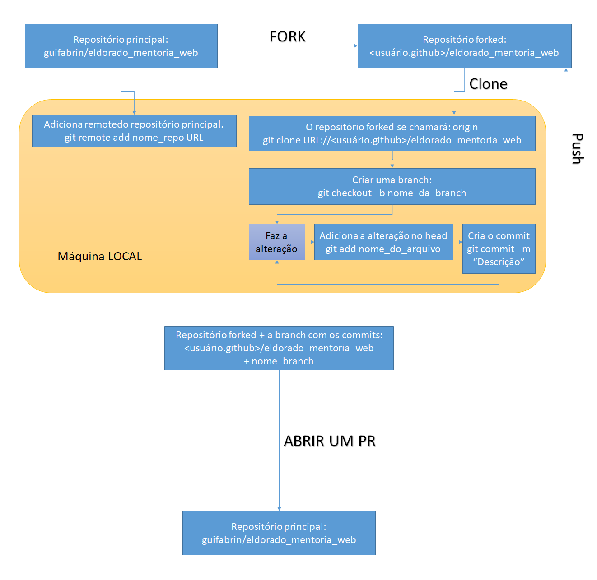

# Mentoria WEB - Módulo 1 😃

👋 Bem-vindo ao primeiro módulo da Mentoria WEB!

## Objetivo 🎯
Neste primeiro passo, nosso objetivo é compreender a estrutura básica de uma página WEB utilizando HTML5, CSS3 e Javascript. Vamos criar uma página que faça a busca de usuários e liste seus repositórios no Github. Você terá liberdade para estilizar a sua página do jeito que quiser, sem a necessidade de utilizar frameworks neste momento. Os exemplos apresentados não são mandatórios.

## Git 🐙
Para começar, faça um fork deste projeto para poder trabalhar com pull requests. Se você não estiver familiarizado com o Git e o Github, você pode aprender mais sobre como fazer um fork, clone e outros comandos em [https://rogerdudler.github.io/git-guide/index.pt_BR.html](https://rogerdudler.github.io/git-guide/index.pt_BR.html).

A imagem abaixo ilustra o fluxo de trabalho que iremos desenvolver no Git:

## Página WEB 🌐
Referências:
- HTML básico: [https://developer.mozilla.org/pt-BR/docs/Learn/Getting_started_with_the_web/HTML_basics](https://developer.mozilla.org/pt-BR/docs/Learn/Getting_started_with_the_web/HTML_basics)
- CSS básico: [https://developer.mozilla.org/pt-BR/docs/Learn/Getting_started_with_the_web/CSS_basics](https://developer.mozilla.org/pt-BR/docs/Learn/Getting_started_with_the_web/CSS_basics)
- Javascript básico: [https://developer.mozilla.org/pt-BR/docs/Learn/Getting_started_with_the_web/JavaScript_basics](https://developer.mozilla.org/pt-BR/docs/Learn/Getting_started_with_the_web/JavaScript_basics)
- Clean Code em Javascript: [https://github.com/ryanmcdermott/clean-code-javascript](https://github.com/ryanmcdermott/clean-code-javascript)

### Passo 1️⃣: Página de pesquisa de usuário do Github
Crie uma página inicial como um buscador, contendo apenas um campo de pesquisa para o nome de usuário e um botão. Utilize HTML e CSS para criar a estrutura da página e o estilo desejado.

🔍 Dica: Utilize técnicas de clean code, seguindo as práticas de Clean Code em Javascript, disponíveis em [https://github.com/ryanmcdermott/clean-code-javascript](https://github.com/ryanmcdermott/clean-code-javascript), para manter um código organizado e de fácil leitura.

### Passo 2️⃣: Listagem de informações
Após isso, crie um botão que liste as informações do usuário e os repositórios que ele possui, seguindo os modelos de referência. Utilize Javascript para consumir a API do Github (https://api.github.com) e os endpoints fornecidos:

- Endpoint user: https://api.github.com/users/USER_GITHUB
- Endpoint repos: https://api.github.com/users/USER_GITHUB/repos

## Fim 🎉
- Construa o HTML a partir dos dados obtidos com o fetch em Javascript.
- Faça um pull request com o resultado em /docs/<nome.usuario>/modulo