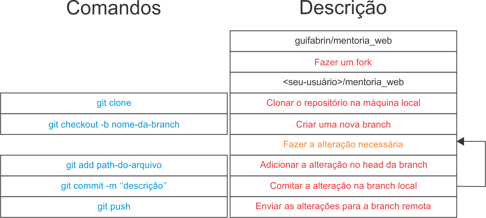

# Mentoria WEB - Módulo 1

Bem-vindo ao primeiro módulo da Mentoria WEB!

## Objetivo
Neste primeiro passo, nosso objetivo é compreender a estrutura básica de uma página WEB utilizando HTML5, CSS3 e Javascript. Vamos criar uma página que faça a busca de usuários e liste seus repositórios no Github. Você terá liberdade para estilizar a sua página do jeito que quiser, sem a necessidade de utilizar frameworks neste momento. Os exemplos apresentados não são mandatórios.

## Git
Para começar, faça um fork deste projeto para poder trabalhar com pull requests. A imagem abaixo ilustra o fluxo de trabalho do Git:

## Página WEB
Referências:
- HTML básico: [https://developer.mozilla.org/pt-BR/docs/Learn/Getting_started_with_the_web/HTML_basics](https://developer.mozilla.org/pt-BR/docs/Learn/Getting_started_with_the_web/HTML_basics)
- CSS básico: [https://developer.mozilla.org/pt-BR/docs/Learn/Getting_started_with_the_web/CSS_basics](https://developer.mozilla.org/pt-BR/docs/Learn/Getting_started_with_the_web/CSS_basics)
- Javascript básico: [https://developer.mozilla.org/pt-BR/docs/Learn/Getting_started_with_the_web/JavaScript_basics](https://developer.mozilla.org/pt-BR/docs/Learn/Getting_started_with_the_web/JavaScript_basics)

Crie uma página inicial como um buscador, contendo apenas um campo de pesquisa para o nome de usuário e um botão. Em uma página secundária, liste as informações do usuário e os repositórios que ele possui, seguindo os modelos de referência.

## Javascript - Integração
Utilize o método nativo fetch em Javascript para consumir a API do Github (https://api.github.com) e os seguintes endpoints:
- Endpoint user: https://api.github.com/users/USER_GITHUB
- Endpoint repos: https://api.github.com/users/USER_GITHUB/repos

## Dica
Utilizar um formatador de arquivos ou técnicas de clean code pode ajudar a ter uma visão melhor do seu projeto.

## Fim
- Construa o HTML a partir dos dados obtidos com o fetch.
- Faça um pull request com o resultado em /docs/<nome.usuario>/modulo_1/.